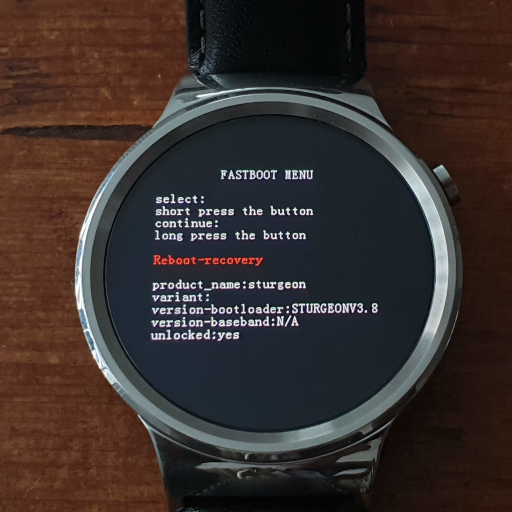
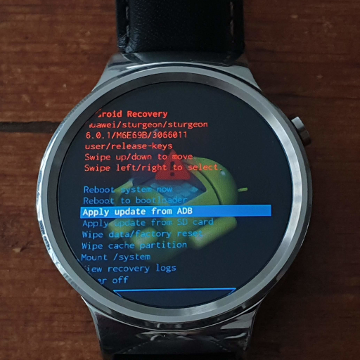

# /system/ directory build instructions

This document describes how to build the system-dir tarball, needed for the ray platform to function properly. The archive contains original Android Wear parts (mostly /system/) and recompiled parts for libhybris compatibility (/include/ and /usr/libexec/hal-droid/system/lib/).


## 1. Know how to boot to fastboot and recovery

You will need to know how to get into the fastboot menu and the Android recovery. These are depicted in the images below.

Fastboot menu             |  Android Recovery
:------------------------:|:-------------------------:
  |  

To get into the fastboot menu you can use the `adb reboot bootloader` command when booted to Android Wear. Make sure you have ADB debugging enabled on Android Wear.
From the fastboot menu you can boot to the Android Recovery.

## 2. Getting the system files.

It is very likely that you are currently running an up-to-date version of WearOS on the Huawei Watch. This version may be incompatible/unsupported by AsteroidOS. We need to go back to an older version to get the system and firmware files known to work with AsteroidOS.

When you follow this document correctly the flow of system build numbers will be: up-to-date version -> M6E69F -> M9E41V.

Below you can find some links where you can find the system files for ME69F and update file for M9E41V:
* M6E69F full system: https://androidfilehost.com/?fid=745425885120748838 or http://www.rootjunkysdl.com/files/Huawei%20Watch/Firmware/ray-m6e69f-wear-stock.zip
* M9E41V OTA file: https://my.hidrive.com/lnk/GrljFu3i

### 2.1 Install M6E69F

Use the following commands to downgrade the system, make sure that your watch is currently in fastboot mode:

```sh
fastboot flash bootloader bootloader-ray-m6e69f.img
fastboot reboot-bootloader
```
Wait for fastboot menu to be available again. Then downgrade the system. You may need to extract a zip archive to find the boot.img, recovery.img, system.img, userdata.img and cache.img files.

```sh
fastboot flash boot boot.img
fastboot flash recovery recovery.img
fastboot flash system system.img
fastboot flash userdata userdata.img
fastboot flash cache cache.img
fastboot -w
```

### 2.2 Update M6E69F to M9E41V

Now boot to the Android Recovery and select `Apply update from ADB`. Use the `adb sideload update.zip` command on your host PC to start the update. Make sure to clear cache afterwards.

### 2.3 Get M9E41V system and firmware files

We need the system files and firmware files.
Use the following commands to get them:
```sh
adb pull /system/ system
adb pull /firmware/ firmware
```

### 2.4 Prepare /system

We can now copy the firmware files to the proper directory and adjust some symlinks:
```sh
cp -r firmware/image/* system/vendor/firmware/

cd system/
rm -rf app/ fonts/ framework/ media/ priv-app/ xbin/
sed -i "/persist.hwc.mdpcomp.enable=true/d" build.prop
sed -i -e '$asys.hwc.gpu_perf_mode=1' build.prop
cd vendor/lib/egl/
ln -s libGLESv2_adreno.so libGLESv2S3D_adreno.so
cd ../../../lib/hw/
ln -s /usr/libexec/hal-droid/system/lib/hw/hwcomposer.msm8909.so hwcomposer.ray.so
ln -s /usr/libexec/hal-droid/system/lib/hw/gralloc.msm8909.so gralloc.ray.so
ln -s /usr/libexec/hal-droid/system/lib/hw/memtrack.msm8909.so memtrack.ray.so
cd ../../../
```

## 3. Patch bionic and GPU drivers

libhybris requires a patched bionic and GPU drivers with the QCOM_BSP flag enabled. These parts are open-source so we can rebuild them.

### 3.1 Download repo

Download all the files needed for compilation:
``` sh
curl https://storage.googleapis.com/git-repo-downloads/repo > repo
chmod a+x repo
mkdir -p android-ray/
cd android-ray

../repo init -u https://github.com/MagneFire/android_manifest -b nougat-mr1.8-release -g all,-notdefault,-darwin,-mips --depth=1
../repo sync
```

### 3.2 Build

Build everything:
```sh
. build/envsetup.sh
#export TARGET_USES_C2D_COMPOSITION=true # Needed by copybit
export TARGET_USES_QCOM_BSP=true        # Fixes GPU problems on QCOM platforms
export TARGET_BOARD_PLATFORM=msm8909    # We Specify the SoC by hand
export QCOM_BOARD_PLATFORMS=msm8909
export PLATFORM_VERSION=7.1.1
export LC_ALL=C                         # Fix _nl_intern_locale_data: Assertion `cnt < (sizeof (_nl_value_type_LC_TIME) / sizeof (_nl_value_type_LC_TIME[0]))' failed

mmma hardware/qcom/display/msm8909/     # hwcomposer, gralloc, dependencies...
mmma frameworks/native/cmds/servicemanager/
mmma system/core/logd/
mmma system/core/init/
mma libminisf
```

### 3.3 Installation

Make sure that most libraries are separated from the original libraries from Android Wear.
```sh
cp out/target/product/generic/root/init ../system/bin/
cp -r out/target/product/generic/system/bin/* ../system/bin/
chmod +x ../system/bin/*

cp -r out/target/product/generic/system/usr/* ../system/usr/
mkdir -p ../usr/libexec/hal-droid/system/lib/
cp -r out/target/product/generic/system/lib ../usr/libexec/hal-droid/system
cd ../
```

## 4. libhybris headers

The second part of this tarball contains header files to compile against
libhybris. There is a script in the libhybris distribution that can pull
the header files from the downloaded android distribution (above).
```sh
android-ray/libhybris/utils/extract-headers.sh -v 7.1.1 -p /usr/include/android android-ray include

```

Make sure that packages that use android libraries actually know about the modified libraries.
```sh
sed -i  '/\CONFIG GOES HERE/a #define QCOM_BSP\n#define QTI_BSP' include/android-config.h
```

## 5. Putting it all together

With the system and include directories, you can create the system-dir tarball:
```sh
tar zcvf system-NXH20B.tar.gz system include usr
```