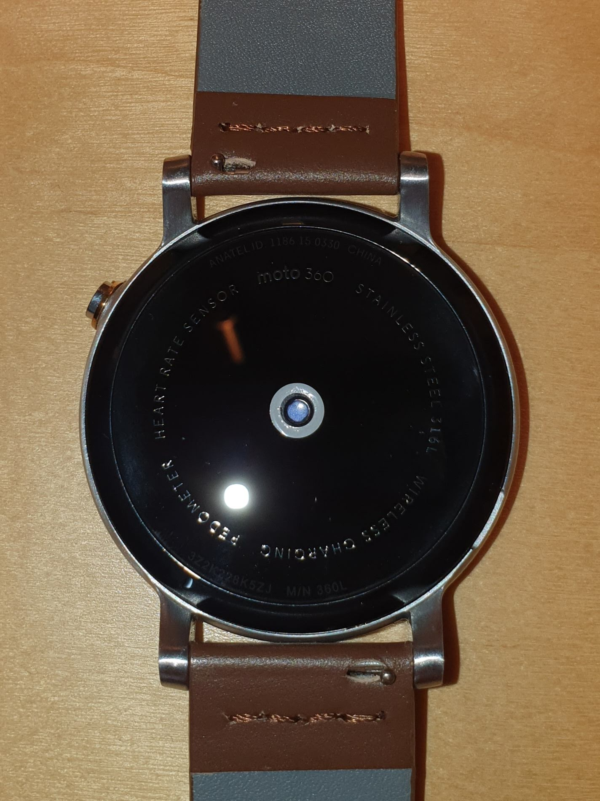
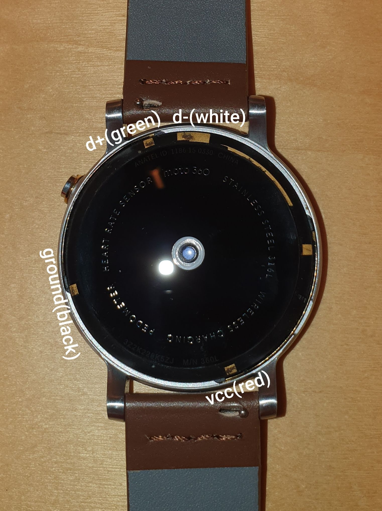

# /system/ directory build instructions

This document describes how to build the system-dir tarball, needed for the smelt platform to function properly. The archive contains original Android Wear parts (mostly /system/) and recompiled parts for libhybris compatibility (/include/ and /usr/libexec/hal-droid/system/lib/).

## 0. Connect the watch via USB.

The Moto 360 2015 doesn't expose a USB connection. It is however possible to connect to the watch using an adapter cable.

The first step is to remove the plastic outer ring. This is fairly straightforward as the ring can be lifted when putting a finger nail underneeth the small lip.

Then you can either solder to the appropriate pads or 3D print a dock.

See https://forum.xda-developers.com/showpost.php?p=76733989&postcount=29 on which pad corresponds to which USB pin.

See https://www.thingiverse.com/thing:4366014 on a 3D prinable dock that can be used to interface with the watch (Additionally needs pogo pins).


Back side of Moto 360     |  Exposed USB pins
:------------------------:|:-------------------------:
 |  

## 1. Know how to boot to fastboot and recovery

You will need to know how to get into the fastboot menu.

To get into the fastboot menu you can use the `adb reboot bootloader` command when booted to Android Wear. Make sure you have ADB debugging enabled on Android Wear.

Another way to get to the fastboot menu is by using the power button. Make sure that the watch is off.

Now press and hold the power button. It'll vibrate once. Keep holding until it vibrates another two times. Fastboot menu will popup.

## 2. Getting the system files.

A marshmallow base is needed for the Moto 360 2015. This can be easily found on online resources (search "MEC23G Moto 360").
The boot and system images are required. The boot image contains the firmware for the touchscreen to work. And the system image contains the needed blobs for the graphics and sensors to work.

It is assumed that you know how to extract these images (Google is your friend :D).

### 2.1 Prepare /system

We can now copy the firmware files to the proper directory and adjust some symlinks:
```sh
cp -r boot/initramfs/firmware/image/* system/vendor/firmware/

cd system/
rm -rf app/ fonts/ framework/ media/ priv-app/ xbin/
sed -i "/persist.hwc.mdpcomp.enable=true/d" build.prop
cd vendor/lib/egl/
ln -s libGLESv2_adreno.so libGLESv2S3D_adreno.so
cd ../../../lib/hw/
ln -s /usr/libexec/hal-droid/system/lib/hw/hwcomposer.msm8226.so hwcomposer.smelt.so
ln -s /usr/libexec/hal-droid/system/lib/hw/gralloc.msm8226.so gralloc.smelt.so
ln -s /usr/libexec/hal-droid/system/lib/hw/memtrack.msm8226.so memtrack.smelt.so
cd ../../../
```

## 3. Patch bionic and GPU drivers

libhybris requires a patched bionic and GPU drivers with the QCOM_BSP flag enabled. These parts are open-source so we can rebuild them.

### 3.1 Download repo

Download all the files needed for compilation:
``` sh
curl https://storage.googleapis.com/git-repo-downloads/repo > repo
chmod a+x repo
mkdir -p android-smelt/
cd android-smelt

../repo init -u https://github.com/AsteroidOS/android_manifest -b marshmallow-dr1.5-release -g all,-notdefault,-darwin,-mips --depth=1
../repo sync
```

### 3.2 Build

Build everything:
```sh
. build/envsetup.sh
export TARGET_USES_C2D_COMPOSITION=true # Needed by copybit
export TARGET_USES_QCOM_BSP=true        # Fixes GPU problems on QCOM platforms
export TARGET_BOARD_PLATFORM=msm8226    # We Specify the SoC by hand
export QCOM_BOARD_PLATFORMS=msm8226
export PLATFORM_VERSION=6.0.1

mmma hardware/qcom/display/msm8226/     # hwcomposer, gralloc, dependencies...
mmma frameworks/native/cmds/servicemanager/
mmma system/core/logd/
mmma system/core/init/
```

### 3.3 Installation

Make sure that most libraries are separated from the original libraries from Android Wear.
```sh
cp out/target/product/generic/root/init ../system/bin/
cp -r out/target/product/generic/system/bin/* ../system/bin/
chmod +x ../system/bin/*

cp -r out/target/product/generic/system/usr/* ../system/usr/
mkdir -p ../usr/libexec/hal-droid/system/lib/
cp -r out/target/product/generic/system/lib ../usr/libexec/hal-droid/system
cd ../
```

## 4. libhybris headers

The second part of this tarball contains header files to compile against
libhybris. There is a script in the libhybris distribution that can pull
the header files from the downloaded android distribution (above).
```sh
git clone https://github.com/libhybris/libhybris
./libhybris/utils/extract-headers.sh -v 6.0.1 -p /usr/include/android android-smelt include

```

Add `#define QCOM_BSP` to `include/android-config.h` if you want the command `test_hwcomposer` to work properly.

## 5. Putting it all together

With the system and include directories, you can create the system-dir tarball:
```sh
tar zcvf system-MEC23G.tar.gz system include usr
```